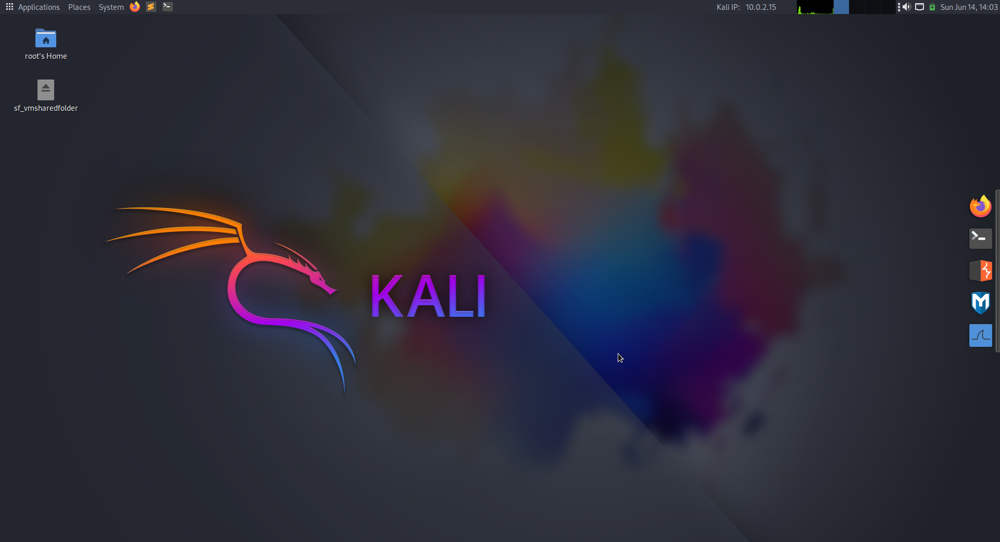

# Overview
This repository provides an automated provisioning script for building a TryHackMe-styled Kali Linux virtual machine. It is designed to quickly transform a fresh Kali installation into a preconfigured environment.
The script installs and configures MATE desktop environment, applies a customized visual theme and sets up a structured panel and dock layout. It also includes UI enhancements such as a Plank dock, custom terminal and mate-panel appearance, and a preconfigured wallpaper.

# What it does
- Installs and configures MATE Desktop Environment
- Applies Arc Dark theme and Papirus-Dark icons
- Sets up a Plank dock with common security tools
- Configures MATE panel layout with system widgets and shortcuts
- Customizes MATE Terminal appearance
- Applies a custom wallpaper (Kali-themed)

# How to use
Before executing the script you have to enable root login from GUI. We can do this by setting a root password:
```
sudo passwd
```
Now reboot your system and login as root. Then open a terminal and execute the provided `kali-mate.sh` script:
```
curl -sSL https://raw.githubusercontent.com/d1mov/kali-mate-desktop/main/kali-mate.sh | bash
```
Thats it! Once the script finishes, the system will automatically reboot. After logging back in, the environment should look like the screenshow below:

